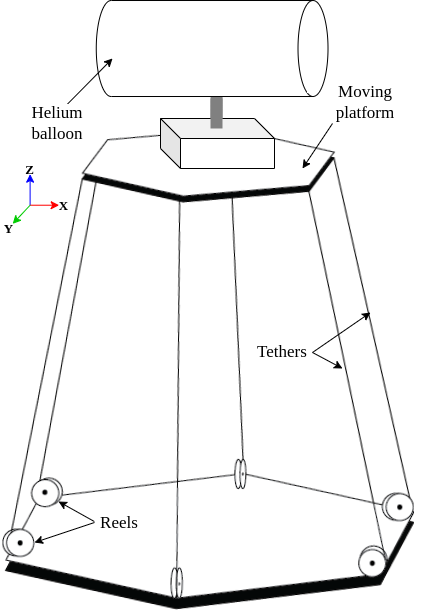
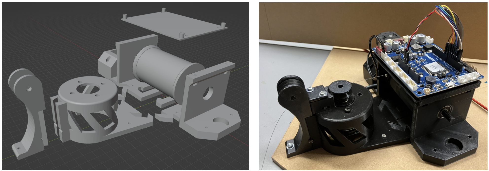
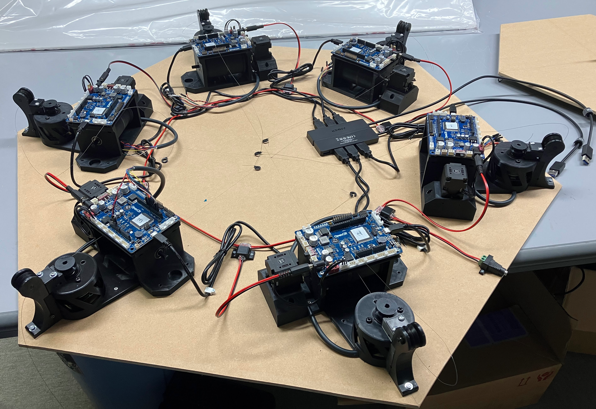
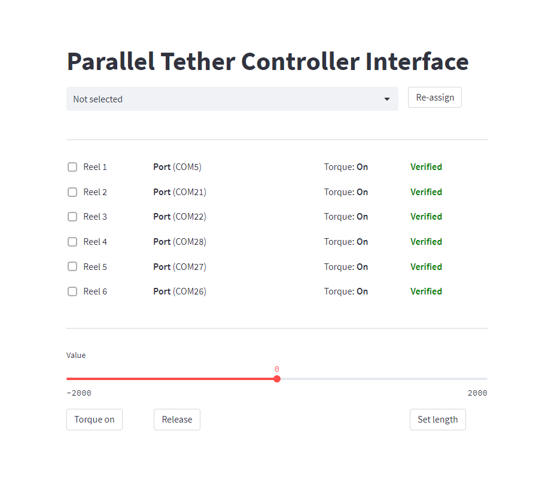

## Parallel Tether Control System for Data Collection in Nuclear Disaster Site
Completed in 2023 July.
### Abstract

Collecting data from higher places in nuclear disaster sites presents numerous challenges due to the limitations of ground robots. Although drones offer a promising solution, there are some issues such as turbulence generated by propellers, communication limitations, and restricted flight time and range. To address these challenges, we propose a novel parallel tether system that utilizes six adjustable tethers to control the position and orientation of an attached compound sensor module. The design incorporates six individual motorized reels to effectively pull the tethers, exerting downward force for stability and maneuverability. Furthermore, by utilizing a helium balloon, the system leverages lift force to elevate the sensor base, facilitating aerial movement. Testing of the developed system with some counterweights has demonstrated a fair level of accuracy in vertical and horizontal movements. The parallel tether system shows significant potential as a viable alternative for data collection in nuclear disaster sites, mitigating the risks associated with traditional drone operations and overcoming the limitations of conventional ground robot technologies.

#### Sketch


### 3D modeling

FreeCAD CAD modeling tool was used to design the robot.

#### Reel Assembly 
3D model and the printed assembly can be seen in the image.


### Complete Assembly
After successfully testing the reel, 6 of them were created and completed the final assembly.


### Software

##### Hardware Programming
OpenCR processing board was used for each reel as seen in the reel assembly image.
Arduino code can be found in the `Arduino_code` directory to program the OpenCR board.

##### Control GUI
Streamlit based web UI was developed to control the tether length.


#### Setting up the environment and installing dependencies
```bash
cd Python_code
python -m venv env
source env/bin/activate
pip install -r requirements.txt
```

#### Running the application
```bash
streamlit run mainv4.py
```